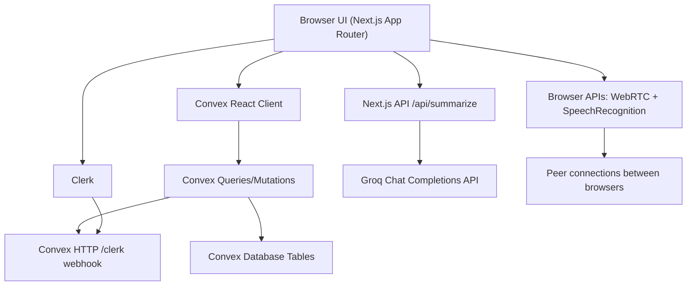

# Meeting Bot Current Implementation Snapshot

Snapshot date: 2026-03-22

This document describes the current codebase as implemented today. It focuses on what is actually wired up in code, how the main workflows behave, how the folders are organized, what the architecture looks like, and where the current gaps or placeholders are.

## 1. Executive Summary

Meeting Bot is a Next.js 16 + React 19 application that uses Clerk for authentication and organizations, Convex for the backend/database/realtime layer, browser-native WebRTC for live media, browser Speech Recognition for live transcription, and a small Next.js API route for AI summarization via Groq.

The application is already functional as a lightweight internal meeting workspace:

- users can sign in with Clerk
- users can create or join organizations
- users can create instant or scheduled meetings
- users can join a browser-based meeting room
- users can exchange chat messages in realtime
- users can stream browser speech recognition transcript lines into Convex
- users can manually generate and save a meeting summary
- users can view meetings, basic insights, tasks, organization settings, and notifications

The application is not yet a full production meeting platform. Several areas are still simplified:

- no TURN server, so WebRTC depends on STUN-only connectivity
- transcription is local browser speech recognition, not server-side meeting audio processing
- summarization is manual and triggered from the meeting side panel
- integrations are seeded in the database but there is no dedicated integrations UI
- some routes and older design-system classes are still transitional

## 2. Stack and Runtime Model

### Frontend

- Next.js `16.2.1` with App Router
- React `19.2.4`
- TypeScript strict mode
- Tailwind CSS v4 with CSS variables
- shadcn/ui style config: `radix-lyra`
- Lucide icons
- Sonner for toast notifications

### Authentication and Multi-tenancy

- Clerk for sign-in, sign-up, user profile, organization profile, organization creation, and organization switching
- Convex uses Clerk JWT auth via `convex/auth.config.ts`
- the active Clerk organization ID is used as the tenant boundary for most frontend queries

### Backend and Realtime

- Convex queries and mutations provide the app API
- Convex tables store meetings, participants, transcripts, messages, tasks, notifications, integrations, summaries, organizations, and users
- Convex queries are consumed in the UI through `useQuery`, so the app updates reactively

### Realtime Media

- WebRTC peer-to-peer media is handled in `features/webrtc/hooks/use-webrtc.ts`
- signaling is stored and delivered through Convex `signals`
- ICE config currently uses only Google's public STUN server

### AI

- live transcription uses `window.SpeechRecognition` or `window.webkitSpeechRecognition`
- meeting summarization uses `POST /api/summarize`
- the summarization route calls Groq's OpenAI-compatible API with model `llama-3.3-70b-versatile`

## 3. High-Level Architecture



### Layer responsibilities

- `app/` defines routes, layouts, and metadata.
- `components/` holds shared layout pieces, landing-page components, onboarding flow, and UI primitives.
- `features/` contains domain-focused page components, services, hooks, and types.
- `convex/` contains schema, auth config, HTTP webhook handling, and the main domain API.
- `lib/` contains utility helpers.
- `proxy.ts` protects authenticated routes with Clerk middleware.

## 4. Current End-to-End Workflow

### 4.1 Landing, Auth, and Route Protection

1. A signed-out user lands on `/`.
2. `app/page.tsx` checks `auth()` server-side.
3. If the user is already authenticated, they are redirected to `/dashboard`.
4. Otherwise they see the marketing page built from `components/home/*`.
5. `/sign-in` and `/sign-up` render Clerk components inside the custom auth layout.
6. `proxy.ts` protects `/dashboard(.*)` and `/meeting(.*)` routes with Clerk middleware.

Important current behavior:

- `/onboarding` is not protected in middleware; it self-guards on the client by checking Clerk auth and redirecting if necessary.

### 4.2 App Bootstrapping

The root layout sets up:

- `ClerkProvider`
- `TooltipProvider`
- `Providers`, which wraps the app with `ConvexProviderWithClerk`
- `SyncUserWithConvex`, which pushes the current user and their Clerk organization memberships into Convex after authentication
- `Toaster` for UI notifications

There are two parallel sync paths for identity data:

- client-side sync via `components/sync-user-with-convex.tsx`
- Clerk webhooks handled by `convex/http.ts`

### 4.3 Onboarding

The onboarding flow is implemented in `components/onboarding/onboarding-flow.tsx`.

Workflow:

1. If the visitor is unauthenticated, redirect to `/sign-in`.
2. If the user already has an organization selected, redirect to `/dashboard`.
3. Otherwise show a 3-step UI:
   - use case selection
   - AI preference selection
   - Clerk `CreateOrganization`
4. After organization creation, Clerk redirects to `/dashboard`

Important current behavior:

- use case and AI preference choices are only local UI state
- they are not persisted anywhere

### 4.4 Dashboard

The dashboard lives at `/dashboard` and renders `DashboardPage`.

Workflow:

1. `DashboardShell` checks `useOrganization()`.
2. If no organization is selected, it client-redirects to `/onboarding`.
3. `DashboardPage` calls `api.dashboard.index.getOverview` with the active organization ID.
4. Convex returns:
   - stats
   - recent meetings
   - active meeting, if any
5. The UI renders stat cards, recent meeting links, and a live-status card.

### 4.5 Meeting Creation

Meeting creation is triggered through `CreateMeetingDialog`.

Two paths are implemented:

- instant meeting
- scheduled meeting

Instant flow:

1. user clicks `Start Meeting`
2. dialog calls `createInstantMeeting(...)`
3. helper generates a fallback title like `Quick Meeting - 10:30 AM`
4. Convex `meetings.create` inserts a meeting
5. if `scheduledFor` is absent or in the past, the meeting starts as `active`
6. org members receive notification records in Convex
7. user is routed to `/meeting/{id}`

Scheduled flow:

1. user fills title, description, date, time, and optional agenda
2. the frontend converts date/time into a timestamp
3. helper calls the same Convex `meetings.create` mutation
4. if the timestamp is in the future, the meeting is stored as `scheduled`
5. the page refreshes so the meeting list can update

Important current behavior:

- `/meetings/create` is only a redirect back to `/meetings`
- all creation UI currently lives in the dialog, not a dedicated page

### 4.6 Meetings Archive

The meetings index is `/meetings`.

Workflow:

1. `MeetingsPage` fetches `api.meetings.index.getByOrg`
2. meetings are shown in a simple archive list
3. links resolve as:
   - active or scheduled meeting -> `/meeting/{id}`
   - ended meeting -> `/meeting/{id}/details`

### 4.7 Live Meeting Room

The live meeting room is `/meeting/{id}` and is backed by `MeetingRoomPage`.

Main workflow:

1. frontend fetches meeting details and existing transcript rows from Convex
2. `useWebrtc(meetingId)` immediately joins the meeting as a participant through Convex
3. local camera/microphone access is requested through `getUserMedia`
4. active participants are listed from Convex
5. peer connections are formed for remote participants
6. WebRTC signaling events are stored in Convex `signals`
7. participant state changes are synchronized through Convex mutations
8. browser speech recognition runs locally while the meeting is active
9. final transcript lines are saved into Convex
10. side panel shows chat, AI summary, participant list, and transcript
11. leaving the room ends the meeting if it is not already ended, then routes back to `/meetings`

The room UI is composed from:

- `ParticipantGrid`
- `MeetingControls`
- `MeetingSidePanel`

### 4.8 In-Meeting Chat

Chat is implemented in the side panel.

Workflow:

1. `MeetingSidePanel` subscribes to `messages.list`
2. when the user sends a message, `messages.send`:
   - verifies they joined the meeting
   - inserts a message row
   - updates the meeting's `lastActivityAt`
3. the query updates reactively for all clients

### 4.9 Transcription

Transcription is browser-local, not server-side.

Workflow:

1. `useTranscription` starts `SpeechRecognition`
2. interim lines stay in local React state only
3. final transcript lines are passed to `transcripts.add`
4. Convex stores transcript rows with speaker metadata
5. the transcript tab and meeting details page read from `transcripts.list`

Important current behavior:

- transcription only captures the local browser's speech recognition stream
- the app does not transcribe mixed room audio or uploaded recordings

### 4.10 Summarization

Summarization is manual.

Workflow:

1. user opens the `AI` tab in the meeting side panel
2. clicks `Generate summary`
3. the panel sends non-interim transcript lines to `/api/summarize`
4. the API route formats them as `speaker: text`
5. the API route calls Groq
6. returned markdown-like content is saved through `meetings.saveSummary`
7. summary is stored in `meeting_assets` as type `summary`
8. meeting details and side panel display the latest saved summary

### 4.11 Meeting Details

Ended meetings are primarily viewed at `/meeting/{id}/details`.

The page currently shows:

- meeting title, status, and purpose
- transcript history
- latest summary

It does not yet show:

- action-item extraction
- recording playback
- searchable transcript
- speaker timeline analytics

### 4.12 Notifications

Notifications appear in the header bell.

Workflow:

1. meeting creation inserts notification rows for users whose `orgIds` include the org
2. `NotificationBell` queries unread/read notification rows for the current user and org
3. clicking an unread item triggers `notifications.markRead`
4. links point back to the related meeting

### 4.13 Insights

The `/insights` page shows very lightweight workspace analytics.

Current data returned by Convex:

- total meetings
- active meetings
- ended meetings
- meeting timeline list

This is currently operational reporting, not AI analytics.

### 4.14 Tasks

The `/tasks` page supports simple manual task capture.

Workflow:

1. user enters a title
2. `tasks.create` inserts an `open` task with source `manual`
3. `tasks.list` fetches tasks for the current org and selected status
4. page renders open tasks only by default

There is no task editing, assignment workflow, or completion UI yet.

### 4.15 Organization, Settings, and Integrations

`/organization`:

- renders Clerk `OrganizationProfile`
- also calls `organization.ensureIntegrations`
- if no integrations exist yet, Convex seeds Zoom, Google Calendar, and Slack rows

`/settings`:

- renders Clerk `UserProfile`

`/integrations`:

- currently reuses `OrganizationPage`
- there is no distinct integrations management screen even though integration records exist in Convex

## 5. Realtime and Data Flow Details

### Meeting presence and participant lifecycle

Participants are stored in `meeting_participants`.

Current lifecycle:

1. `participants.join`
2. periodic `participants.heartbeat`
3. optional `participants.updateMedia`
4. `participants.leave`

Tracked participant state includes:

- mic enabled
- camera enabled
- screen sharing enabled
- joined/left status
- last seen timestamp

### WebRTC signaling flow

1. when remote participants appear, the hook decides whether this client should create an offer
2. the offer is sent through `signals.send`
3. the receiving client reads `signals.listForParticipant`
4. answer and ICE candidates flow through the same table
5. media streams are attached to `RTCPeerConnection`
6. `ParticipantGrid` renders local and remote `MediaStream` instances

### Media state flow

- toggling mic/video updates local tracks and Convex participant state
- screen sharing swaps the outgoing video track with `getDisplayMedia`
- stopping screen share restores the camera track

## 6. Data Model

The Convex schema currently defines the following tables.

### `users`

Stores synced user records from Clerk.

Key fields:

- `tokenIdentifier`
- `clerkId`
- `email`
- `fullName`, `firstName`, `lastName`
- `imageUrl`
- `orgIds`

### `organizations`

Stores Clerk organization mirror data.

Key fields:

- `clerkId`
- `name`
- `slug`
- `imageUrl`

### `meetings`

Core meeting records.

Key fields:

- `orgId`
- `title`
- `purpose`
- `description`
- creator metadata
- `status`: `scheduled | active | ended`
- `scheduledFor`
- `startedAt`
- `endedAt`
- `lastActivityAt`

### `meeting_participants`

Tracks room presence and media state.

Key fields:

- `meetingId`
- `userTokenIdentifier`
- `clerkId`
- `name`
- `imageUrl`
- `status`
- `joinedAt`
- `leftAt`
- `lastSeenAt`
- `isMicEnabled`
- `isCameraEnabled`
- `isScreenSharing`

### `messages`

Realtime meeting chat.

Key fields:

- `meetingId`
- `senderParticipantId`
- `senderName`
- `body`
- `createdAt`

### `transcripts`

Persisted transcript lines.

Key fields:

- `meetingId`
- `speakerParticipantId`
- `speakerId`
- `speakerName`
- `text`
- `timestamp`
- `createdAt`

### `meeting_assets`

Stores generated or attached meeting artifacts.

Current types:

- `summary`
- `recording`

Current real usage:

- only `summary` is actively used

### `notifications`

Stores in-app user notifications.

Key fields:

- `userTokenIdentifier`
- `orgId`
- `message`
- `link`
- `isRead`
- `createdAt`

### `signals`

Convex-backed WebRTC signaling transport.

Kinds:

- `offer`
- `answer`
- `ice-candidate`
- `renegotiate`

### `tasks`

Simple org-scoped task records.

Key fields:

- `orgId`
- `meetingId`
- `title`
- `status`
- `assigneeName`
- `dueAt`
- `source`
- `createdAt`

### `integrations`

Seeded integration placeholders.

Key fields:

- `orgId`
- `key`
- `name`
- `category`
- `description`
- `connected`
- `updatedAt`

## 7. Convex Module Responsibilities

### `convex/users/index.ts`

- sync user data from Clerk
- upsert/delete users and organizations from webhooks
- manage organization membership arrays

### `convex/meetings/index.ts`

- create meetings
- fetch single meeting with derived summary and participant count
- fetch meetings by organization
- end meetings
- get/save summaries

### `convex/participants/index.ts`

- join/leave meetings
- heartbeat presence
- update media flags
- list active participants

### `convex/messages/index.ts`

- list meeting chat messages
- send meeting chat messages

### `convex/transcripts/index.ts`

- add transcript lines
- list transcript lines

### `convex/signals/index.ts`

- send signaling events
- list signaling events for a participant

### `convex/dashboard/index.ts`

- build dashboard overview stats and recent meetings

### `convex/insights/index.ts`

- build simple counts and timeline data

### `convex/tasks/index.ts`

- create tasks
- list tasks by org and status

### `convex/notifications/index.ts`

- list notifications for the current user and org
- mark notifications as read

### `convex/organization/index.ts`

- seed default integrations
- list integrations

### `convex/http.ts`

- exposes `/clerk` webhook endpoint
- verifies Svix headers
- mirrors Clerk events into Convex records

## 8. Frontend Structure and File Organization

The project uses a mixed structure:

- route-based organization in `app/`
- reusable UI/layout in `components/`
- domain modules in `features/`

That means page routes stay thin, while real page logic lives inside feature components and feature services.

### Current folder map

```text
app/
  (auth)/
    layout.tsx
    sign-in/[[...sign-in]]/page.tsx
    sign-up/[[...sign-up]]/page.tsx
  (dashboard)/
    layout.tsx
    dashboard/page.tsx
    insights/page.tsx
    integrations/page.tsx
    meeting/[id]/details/page.tsx
    meetings/page.tsx
    meetings/create/page.tsx
    organization/page.tsx
    settings/page.tsx
    tasks/page.tsx
  (meeting-room)/
    meeting/[id]/page.tsx
  (onboarding)/
    layout.tsx
    onboarding/page.tsx
  api/
    summarize/route.ts
    webhooks/clerk/
  favicon.ico
  globals.css
  layout.tsx
  page.tsx

components/
  home/
    navbar.tsx
    hero.tsx
    features.tsx
    footer.tsx
  layout/
    notification-bell.tsx
  onboarding/
    onboarding-flow.tsx
  shared/
    app-sidebar.tsx
    dashboard-shell.tsx
    empty-state.tsx
    loading-block.tsx
  ui/
    accordion.tsx
    alert-dialog.tsx
    alert.tsx
    aspect-ratio.tsx
    avatar.tsx
    badge.tsx
    breadcrumb.tsx
    button-group.tsx
    button.tsx
    calendar.tsx
    card.tsx
    carousel.tsx
    chart.tsx
    checkbox.tsx
    collapsible.tsx
    combobox.tsx
    command.tsx
    context-menu.tsx
    dialog.tsx
    direction.tsx
    drawer.tsx
    dropdown-menu.tsx
    empty.tsx
    field.tsx
    hover-card.tsx
    input-group.tsx
    input-otp.tsx
    input.tsx
    item.tsx
    kbd.tsx
    label.tsx
    menubar.tsx
    native-select.tsx
    navigation-menu.tsx
    pagination.tsx
    popover.tsx
    progress.tsx
    radio-group.tsx
    resizable.tsx
    scroll-area.tsx
    select.tsx
    separator.tsx
    sheet.tsx
    sidebar.tsx
    skeleton.tsx
    slider.tsx
    sonner.tsx
    spinner.tsx
    switch.tsx
    table.tsx
    tabs.tsx
    textarea.tsx
    toggle-group.tsx
    toggle.tsx
    tooltip.tsx
  providers.tsx
  sync-user-with-convex.tsx

features/
  ai/
    components/insights-page.tsx
    hooks/use-transcription.ts
    services/insight-service.ts
    types/
  auth/
    components/
    hooks/
    services/
    types/
  dashboard/
    components/dashboard-page.tsx
    hooks/
    services/dashboard-service.ts
    types/dashboard-types.ts
  meeting/
    components/
      create-meeting-dialog.tsx
      meeting-details-page.tsx
      meeting-form-instant.tsx
      meeting-form-schedule.tsx
      meeting-room-page.tsx
      meeting-side-panel.tsx
      meetings-page.tsx
    hooks/
    services/meeting-service.ts
    types/meeting-types.ts
  organization/
    components/
      organization-page.tsx
      settings-page.tsx
    hooks/
    services/organization-service.ts
    types/
  tasks/
    components/tasks-page.tsx
    hooks/
    services/task-service.ts
    types/
  webrtc/
    components/
      camera-toggle.tsx
      meeting-controls.tsx
      mic-toggle.tsx
      participant-grid.tsx
      screen-share-button.tsx
      video-tile.tsx
    hooks/
      use-audio-activity.ts
      use-webrtc.ts
    services/
    types/webrtc-types.ts

convex/
  auth.config.ts
  http.ts
  schema.ts
  dashboard/index.ts
  insights/index.ts
  lib/
    auth.ts
    meetinghelpers.ts
  meetings/index.ts
  messages/index.ts
  notifications/index.ts
  organization/index.ts
  participants/index.ts
  signals/index.ts
  tasks/index.ts
  transcripts/index.ts
  users/index.ts
  _generated/

hooks/
  use-mobile.ts

lib/
  metadata.ts
  utils.ts

docs/
  application_workflow.md
  architecture.md
  design.md
  current-implementation.md
```

### Structural observations

- `app/` pages are intentionally thin and mostly delegate to feature components.
- `features/` is the real domain layer for page behavior.
- `components/ui/` is much larger than currently needed; many primitives are available but not yet used.
- several feature subfolders exist as placeholders with no implementation yet, especially `features/auth/*`, some `hooks/`, `services/`, and `types/` folders.
- some older root docs are aspirational and do not fully match current code.

## 9. Design System and UI Language

### Current design foundation

The active design system is implemented primarily through:

- `app/globals.css`
- `components.json`
- shared shadcn/ui primitives in `components/ui/*`

### Core visual rules currently in code

- dark mode is forced at the root by applying `className="dark"` on `<html>`
- color tokens are CSS variables mapped into Tailwind via `@theme inline`
- the palette is neutral and editorial rather than bright SaaS colors
- all radius variables are set to `0px`
- a subtle grid + radial background texture is applied to `body`
- borders and thin outlines are used more than shadow-heavy cards

### Typography

The app loads:

- `Inter`
- `Geist`
- `Geist Mono`

The practical result is:

- sans-serif UI typography for nearly everything
- mono support available for technical surfaces

### Component style patterns

Common patterns across the current app:

- rectangular, zero-radius buttons and cards
- small uppercase metadata labels
- border-defined sections instead of heavily elevated surfaces
- neutral `bg-card`, `bg-background`, `border-border`, `text-muted-foreground` usage
- shadcn primitives customized into a more flat/editorial shell

### Important design inconsistency

The main dashboard and meeting experience use the current token system from `globals.css`, but the auth and onboarding routes still use older semantic class names like:

- `bg-surface`
- `text-on-surface`
- `border-outline-variant`
- `bg-primary-container`

Those tokens are not defined in `app/globals.css`. That suggests those screens were built against an earlier or aspirational design vocabulary and are currently out of sync with the main app styling approach.

## 10. What Is Implemented vs. What Is Still Partial

### Clearly implemented

- Clerk auth pages and Clerk middleware protection
- organization onboarding with Clerk `CreateOrganization`
- Convex + Clerk provider integration
- user/org sync into Convex
- meeting creation
- meeting archive
- browser-based meeting room
- WebRTC participant mesh with Convex signaling
- realtime chat
- browser speech recognition transcript capture
- manual AI summary generation and persistence
- meeting details page
- simple dashboard, insights, tasks, notifications
- Clerk organization and user profile pages

### Partial or placeholder

- integrations: database seeding exists, dedicated UI does not
- tasks: create/list only, no edit/complete/reassign flow
- insights: counts and timeline only, no advanced analytics
- meeting assets: recording type exists in schema but is not actively used
- action items: not extracted automatically from summaries
- scheduling: scheduled meetings are stored, but there is no scheduler or calendar/event runner
- onboarding preferences: collected in UI only, not persisted
- app/api/webhooks/clerk directory exists but is unused because Clerk webhooks are handled in Convex `http.ts`

## 11. Important Current Implementation Caveats

These are not aspirations; they are current code-level realities.

### Product-level caveats

- summaries are generated only when the user clicks the button
- transcript quality depends on the local browser speech-recognition engine
- WebRTC reliability may be limited in stricter network environments because there is no TURN server
- integrations are represented mostly as seeded records

### Architecture and behavior caveats

- the dashboard summary count is not org-scoped; it counts `meeting_assets` globally
- the dashboard recent-meeting links always point to `/meeting/{id}`, even for ended meetings, while the archive page correctly routes ended meetings to `/meeting/{id}/details`
- scheduled meetings are created as `scheduled`, but `participants.join` does not promote them to `active` or set `startedAt`
- `/integrations` currently renders the same page as `/organization`
- notification read-marking does not verify ownership before patching

## 12. Final Assessment

The current application is best described as a solid realtime meeting-workspace prototype with real end-to-end vertical slices already implemented:

- auth and tenancy
- Convex-backed realtime data
- browser-based meeting rooms
- live transcript persistence
- manual AI summary generation
- lightweight workspace operations pages

The strongest architectural decision in the current codebase is the separation between:

- thin Next.js routes
- domain-specific `features/*`
- Convex domain modules

That structure is already good enough to scale the app further.

The main next-stage work, if this project continues, would likely be:

- hardening the meeting lifecycle
- replacing browser-only transcription with a real media pipeline
- adding TURN and more robust WebRTC handling
- building a real integrations UI and backend
- turning summaries into structured tasks/action items
- unifying the design tokens across auth/onboarding and dashboard surfaces
