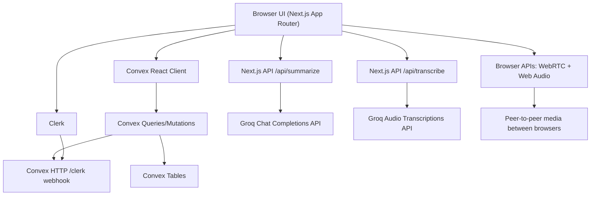

# Meeting Bot Current Implementation Snapshot

Snapshot date: 2026-03-22

This document describes what is actually implemented in the current codebase. It is based on the source currently present in `app/`, `features/`, `components/`, and `convex/`, not on older architectural plans.

## 1. Executive Summary

Meeting Bot is a Next.js 16 + React 19 application that uses Clerk for auth and organizations, Convex for backend/database/realtime state, WebRTC for live media, browser Web Audio APIs for microphone capture, and Next.js API routes for AI transcription and summarization through Groq.

Today the app already supports a real end-to-end meeting workflow:

- Clerk sign-in and sign-up
- organization onboarding with Clerk organization creation
- Convex-backed user and organization sync
- instant and scheduled meeting creation
- meeting archive and dashboard views
- live meeting room with WebRTC participant media
- Convex-backed chat, participant presence, and signaling
- local microphone capture -> transcription API -> Convex transcript persistence
- AI summary generation with structured key points, decisions, and action items
- automatic task creation from generated summary action items
- meeting details page for ended meetings
- notifications, simple insights, and simple tasks

This is still a prototype / early product implementation, not a hardened production system. The main limitations right now are around security hardening, meeting lifecycle rules, TURN-less WebRTC, and incomplete integrations/task workflows.

## 2. Stack and Runtime Model

### Frontend

- Next.js `16.2.1` with App Router
- React `19.2.4`
- TypeScript with `strict: true`
- Tailwind CSS v4
- shadcn/ui style component set plus custom shared components
- Sonner for toast notifications
- Lucide React icons

### Authentication and Tenancy

- Clerk is used for:
  - sign-in and sign-up
  - user profile
  - organization profile
  - organization creation and switching
- Convex is configured to trust Clerk JWTs through `convex/auth.config.ts`
- the active Clerk organization ID is used by most frontend pages as the workspace/org boundary

### Backend and Realtime

- Convex queries and mutations are the main app API
- Convex stores meetings, participants, messages, transcripts, meeting assets, notifications, tasks, integrations, summary chunks, organizations, and users
- the frontend subscribes to Convex with `useQuery`, so many views update reactively

### Realtime Media

- browser-to-browser media is handled by `features/webrtc/hooks/use-webrtc.ts`
- signaling is stored in the Convex `signals` table
- the current ICE config is STUN-only using `stun:stun.l.google.com:19302`

### AI

- `POST /api/transcribe` sends audio to Groq Whisper (`whisper-large-v3`)
- `POST /api/summarize` sends transcript text to Groq chat completions (`llama-3.3-70b-versatile`)
- summaries are saved back into Convex and can create tasks automatically

## 3. High-Level Architecture



### Layer Responsibilities

- `app/` contains routes, layouts, and metadata wrappers
- `components/` contains shared UI primitives, layout shell pieces, landing page sections, onboarding UI, and providers
- `features/` contains the actual page logic for dashboard, meetings, AI, organization, tasks, and WebRTC
- `convex/` contains schema, auth config, HTTP webhooks, and domain queries/mutations
- `lib/` contains utilities and metadata helpers
- `proxy.ts` protects authenticated routes with Clerk middleware

## 4. Current End-to-End Workflow

### 4.1 Landing, Auth, and Route Protection

1. A signed-out user lands on `/`.
2. `app/page.tsx` checks Clerk auth on the server.
3. Authenticated users are redirected to `/dashboard`.
4. Signed-out users see the marketing landing page from `components/home/*`.
5. `/sign-in` and `/sign-up` render Clerk auth UI in the custom auth layout.
6. `proxy.ts` protects `/dashboard(.*)` and `/meeting(.*)` routes.

Important current behavior:

- `/onboarding` is not protected by middleware, but the onboarding UI redirects unauthenticated users to `/sign-in`

### 4.2 App Bootstrapping

The root layout wires up:

- `ClerkProvider`
- `TooltipProvider`
- `Providers`, which uses `ConvexProviderWithClerk`
- `SyncUserWithConvex`, which syncs the signed-in user and their org memberships into Convex
- `Toaster`

Identity data is currently synced through two paths:

- client-side sync in `components/sync-user-with-convex.tsx`
- Clerk webhook handling in `convex/http.ts`

### 4.3 Onboarding

The onboarding experience is implemented in `components/onboarding/onboarding-flow.tsx`.

Current flow:

1. If not signed in, redirect to `/sign-in`
2. If an organization is already selected, redirect to `/dashboard`
3. Otherwise show a multi-step onboarding UI
4. Final step uses Clerk `CreateOrganization`
5. After org creation, Clerk sends the user to `/dashboard`

Current limitation:

- onboarding preferences are UI-only and are not persisted anywhere

### 4.4 Dashboard

`/dashboard` renders `DashboardPage`.

Current flow:

1. `DashboardShell` checks whether a Clerk organization is selected
2. If no organization is selected, the user is redirected to `/onboarding`
3. `DashboardPage` fetches `api.dashboard.index.getOverview`
4. Convex returns:
   - summary stats
   - recent meetings
   - one active meeting if present
5. The page renders overview cards, recent meeting links, and a live-status card

### 4.5 Meeting Creation

Meeting creation happens through `CreateMeetingDialog` and the meeting form components in `features/meeting/components/`.

Two paths exist:

- instant meeting
- scheduled meeting

Instant flow:

1. user clicks the start action
2. the frontend creates a fallback title when needed
3. `meetings.create` inserts the meeting
4. meetings with no future `scheduledFor` timestamp are created as `active`
5. notifications are inserted for org members found in Convex
6. the user is routed into `/meeting/{id}`

Scheduled flow:

1. user enters title, date, time, and optional details
2. the frontend converts date/time into a timestamp
3. the same `meetings.create` mutation is used
4. future meetings are stored as `scheduled`
5. the meetings list refreshes

Important current behavior:

- `/meetings/create` is only a redirect to `/meetings`
- there is no dedicated create page UI; creation is dialog-driven

### 4.6 Meetings Archive

`/meetings` renders `MeetingsPage`.

Current flow:

1. the page fetches `api.meetings.index.getByOrg`
2. meetings are shown in a simple archive list
3. links go to:
   - `/meeting/{id}` for active or scheduled meetings
   - `/meeting/{id}/details` for ended meetings

### 4.7 Live Meeting Room

`/meeting/{id}` renders `MeetingRoomPage`.

Current flow:

1. the page subscribes to the meeting document and transcript rows from Convex
2. `useWebrtc(meetingId)` joins the participant into the room
3. browser camera/microphone permission is requested through `getUserMedia`
4. participant rows are read from Convex
5. remote peer connections are established
6. signaling is exchanged through the Convex `signals` table
7. media state is synced back to Convex
8. local microphone audio is captured and chunked for transcription
9. transcript lines are batch-saved into Convex
10. the side panel exposes chat, AI summary, participants, and transcript
11. leaving the room currently also ends the meeting if it is not already ended

The room UI is composed primarily from:

- `ParticipantGrid`
- `MeetingControls`
- `MeetingSidePanel`

### 4.8 In-Meeting Chat

Chat is implemented inside `MeetingSidePanel`.

Current flow:

1. the side panel subscribes to `messages.list`
2. sending a message calls `messages.send`
3. Convex verifies the sender joined the meeting
4. the message row is inserted
5. the meeting `lastActivityAt` timestamp is updated
6. all subscribed clients receive the new data reactively

### 4.9 Transcription

Transcription is handled through browser audio capture plus a server transcription route.

Current flow:

1. `useTranscription` captures raw PCM audio through the Web Audio API
2. a simple VAD-style threshold/hangover flow detects speech regions
3. voiced chunks are encoded as WAV
4. chunks are sent to `/api/transcribe`
5. the API supports `auto`, `hinglish`, `hindi`, and `english` modes
6. Groq Whisper returns text
7. the route applies a cleanup pass and prompt-leak filtering
8. final lines are queued and batch-written into Convex with `transcripts.addBatch`
9. transcript views read from `transcripts.list`

Important current behavior:

- only the local browser microphone is transcribed
- there is no mixed-room or uploaded-recording transcription pipeline

### 4.10 Summarization

Summarization is implemented in two ways:

- manual summary generation from the AI tab in the meeting side panel
- automatic periodic summary refresh inside the live meeting room every 5 minutes while the room is active

Current flow:

1. transcript lines are converted into a flat `sender: text` payload
2. `/api/summarize` calls Groq with a JSON response format
3. the route returns:
   - `summary`
   - `key_points`
   - `decisions`
   - `action_items`
   - `actionItems` flat task title list
4. `meetings.saveSummary` persists the result into `meeting_assets`
5. `tasks.createFromSummary` creates deduplicated tasks from action items
6. summary data is shown in the meeting side panel and meeting details page

Important current behavior:

- the side panel supports manual generate/regenerate
- the meeting room also attempts automatic summary generation on an interval and when leaving the room

### 4.11 Meeting Details

Ended meetings are reviewed at `/meeting/{id}/details`.

Current page content:

- meeting metadata
- transcript history
- saved AI summary
- rendered key points
- rendered decisions
- rendered action items

Not implemented there yet:

- recording playback
- transcript search/filtering
- speaker analytics or timeline views

### 4.12 Notifications

Notifications appear in the header bell component.

Current flow:

1. meeting creation inserts notification rows for org members
2. the bell queries notifications for the current user and current org
3. unread notifications can be marked read
4. notifications link back into meeting routes

### 4.13 Insights

`/insights` shows lightweight reporting.

Current data returned by Convex:

- total meetings
- active meetings
- ended meetings
- simple meeting timeline rows

This is currently operational reporting, not advanced AI analytics.

### 4.14 Tasks

`/tasks` renders a simple task page.

Current flow:

1. user types a title
2. `tasks.create` inserts an open manual task
3. `tasks.list` loads tasks by org and status
4. the page renders the current list

Tasks are also created automatically from summary action items through `tasks.createFromSummary`.

Current limitations:

- no edit flow
- no completion UI
- no reassignment workflow
- no due-date management UI

### 4.15 Organization, Settings, and Integrations

`/organization`:

- renders Clerk `OrganizationProfile`
- calls `organization.ensureIntegrations`
- seeds Zoom, Google Calendar, and Slack rows for the org if missing

`/settings`:

- renders the user settings/profile experience

`/integrations`:

- is currently not a distinct integrations product surface
- the route exists, but the current implementation remains minimal / transitional

## 5. Realtime and Data Flow Details

### Meeting Presence and Participant Lifecycle

Participants live in `meeting_participants`.

Current lifecycle:

1. `participants.join`
2. periodic `participants.heartbeat`
3. optional `participants.updateMedia`
4. `participants.leave`

Tracked participant state includes:

- joined/left status
- joined/left timestamps
- last seen timestamp
- microphone enabled
- camera enabled
- screen-sharing enabled

### WebRTC Signaling Flow

1. when remote participants appear, the hook decides whether to create an offer
2. signaling messages are inserted through `signals.send`
3. recipients subscribe with `signals.listForParticipant`
4. offers, answers, and ICE candidates travel through the same table
5. processed signals are cleared through `signals.clear`
6. remote streams are attached to `RTCPeerConnection` and rendered in the participant grid

### Media State Flow

- mic/video toggles update local tracks and Convex participant flags
- screen sharing swaps the outgoing video track using `getDisplayMedia`
- stopping screen share restores the camera track

## 6. Data Model

The current Convex schema defines these tables.

### `users`

Stores synced Clerk user data.

Key fields:

- `tokenIdentifier`
- `clerkId`
- `email`
- `fullName`
- `firstName`
- `lastName`
- `imageUrl`
- `orgIds`

### `organizations`

Stores mirrored Clerk organization data.

Key fields:

- `clerkId`
- `name`
- `slug`
- `imageUrl`

### `meetings`

Core meeting records.

Key fields:

- `orgId`
- `title`
- `purpose`
- `description`
- `creatorTokenIdentifier`
- `creatorClerkId`
- `creatorName`
- `status`
- `scheduledFor`
- `startedAt`
- `endedAt`
- `lastActivityAt`

### `meeting_participants`

Tracks room presence and media state.

Key fields:

- `meetingId`
- `userTokenIdentifier`
- `clerkId`
- `name`
- `imageUrl`
- `status`
- `joinedAt`
- `leftAt`
- `lastSeenAt`
- `isMicEnabled`
- `isCameraEnabled`
- `isScreenSharing`

### `messages`

Realtime meeting chat.

Key fields:

- `meetingId`
- `senderParticipantId`
- `senderName`
- `body`
- `createdAt`

### `transcripts`

Persisted transcript lines.

Key fields:

- `meetingId`
- `speakerParticipantId`
- `speakerId`
- `speakerName`
- `text`
- `timestamp`
- `createdAt`

### `meeting_assets`

Stores meeting artifacts.

Current types:

- `summary`
- `recording`

Current real usage:

- `summary` is actively used
- `recording` exists in schema only

### `notifications`

Stores in-app notifications.

Key fields:

- `userTokenIdentifier`
- `orgId`
- `message`
- `link`
- `isRead`
- `createdAt`

### `signals`

Convex-backed WebRTC signaling transport.

Kinds:

- `offer`
- `answer`
- `ice-candidate`
- `renegotiate`

### `tasks`

Simple org-scoped tasks.

Key fields:

- `orgId`
- `meetingId`
- `title`
- `status`
- `assigneeName`
- `dueAt`
- `source`
- `createdAt`

### `integrations`

Seeded integration records.

Key fields:

- `orgId`
- `key`
- `name`
- `category`
- `description`
- `connected`
- `updatedAt`

### `summary_chunks`

Stores chunk-level summary snapshots.

Key fields:

- `meetingId`
- `chunkIndex`
- `summary`
- `key_points`
- `decisions`
- `createdAt`

## 7. Convex Module Responsibilities

### `convex/users/index.ts`

- upsert/delete users
- upsert/delete organizations
- add/remove org membership
- sync signed-in user data from Clerk identity

### `convex/meetings/index.ts`

- create meetings
- get a meeting with derived participant/summary fields
- get meetings by org
- end meetings
- get and save summaries

### `convex/meetings/summaryChunks.ts`

- save chunk summaries
- list chunk summaries for a meeting

### `convex/participants/index.ts`

- join and leave rooms
- heartbeat presence
- update media flags
- list active participants

### `convex/messages/index.ts`

- list chat messages
- send chat messages

### `convex/transcripts/index.ts`

- add transcript rows
- add transcript batches
- list transcript rows

### `convex/signals/index.ts`

- list signaling rows for a participant
- send signaling payloads
- clear processed signaling rows

### `convex/dashboard/index.ts`

- build dashboard summary stats and recent meetings

### `convex/insights/index.ts`

- build simple counts and meeting timeline data

### `convex/tasks/index.ts`

- list tasks
- create manual tasks
- create tasks from summary action items

### `convex/notifications/index.ts`

- list notifications for the current user and org
- mark notifications as read

### `convex/organization/index.ts`

- seed default integrations
- list integrations

### `convex/http.ts`

- exposes the `/clerk` Convex HTTP endpoint
- verifies Svix webhook headers
- mirrors Clerk events into Convex records

## 8. Frontend Structure and File Organization

The project is intentionally split into:

- thin route wrappers in `app/`
- shared UI in `components/`
- actual product logic in `features/`

### Current Folder Map

```text
app/
  (auth)/
    layout.tsx
    sign-in/[[...sign-in]]/page.tsx
    sign-up/[[...sign-up]]/page.tsx
  (dashboard)/
    layout.tsx
    dashboard/page.tsx
    insights/page.tsx
    integrations/page.tsx
    meeting/[id]/details/page.tsx
    meetings/page.tsx
    meetings/create/page.tsx
    organization/page.tsx
    settings/page.tsx
    tasks/page.tsx
  (meeting-room)/
    meeting/[id]/page.tsx
  (onboarding)/
    layout.tsx
    onboarding/page.tsx
  api/
    summarize/route.ts
    transcribe/route.ts
  favicon.ico
  globals.css
  layout.tsx
  page.tsx

components/
  home/
  layout/
  onboarding/
  shared/
  ui/
  providers.tsx
  sync-user-with-convex.tsx

features/
  ai/
    components/insights-page.tsx
    hooks/use-transcription.ts
    services/insight-service.ts
  dashboard/
    components/dashboard-page.tsx
    services/dashboard-service.ts
    types/dashboard-types.ts
  meeting/
    components/
    services/meeting-service.ts
    types/meeting-types.ts
  organization/
    components/
    services/organization-service.ts
  tasks/
    components/tasks-page.tsx
    services/task-service.ts
  webrtc/
    components/
    hooks/
    types/webrtc-types.ts

convex/
  auth.config.ts
  http.ts
  schema.ts
  dashboard/index.ts
  insights/index.ts
  lib/
  meetings/
    index.ts
    summaryChunks.ts
  messages/index.ts
  notifications/index.ts
  organization/index.ts
  participants/index.ts
  signals/index.ts
  tasks/index.ts
  transcripts/index.ts
  users/index.ts
  _generated/

hooks/
  use-mobile.ts

lib/
  metadata.ts
  utils.ts

docs/
  current-implementation.md
```

### Structural Observations

- `app/` routes are intentionally thin
- `features/` is the real domain layer
- `components/ui/` is broader than current app usage, which is fine for future growth
- the codebase is much more feature-organized than older docs imply
- some older architecture notes in the repo are now partially outdated

## 9. Design System and UI Language

### Current Design Foundation

The active styling system is primarily built from:

- `app/globals.css`
- `components.json`
- shared primitives in `components/ui/*`

### Visual Direction in Code

- dark mode is forced at the root
- the app relies on tokenized CSS variables
- layout surfaces use borders more than heavy shadows
- most cards and buttons are sharp-cornered / low-radius
- dashboard and meeting views use a restrained, editorial dark theme

### Typography

The app currently loads:

- `Inter`
- `Geist`
- `Geist Mono`

### UI Consistency Notes

- dashboard, meetings, and details pages largely follow the same current token system
- auth and onboarding are visually compatible, though they use a somewhat different composition style than the main dashboard shell

## 10. Implemented vs Partial

### Clearly Implemented

- Clerk auth pages and route protection
- organization onboarding
- Convex + Clerk provider integration
- user/org sync into Convex
- instant and scheduled meeting creation
- meetings archive
- live meeting room
- WebRTC participant mesh with Convex signaling
- realtime chat
- microphone transcription via Groq Whisper
- AI summaries with key points, decisions, and action items
- automatic task creation from summary action items
- meeting details page
- dashboard, insights, tasks, notifications
- organization/settings pages backed by Clerk

### Partial or Placeholder

- integrations: data seeding exists, but there is no full integrations management product yet
- tasks: create/list only; no edit/complete/reassign flow
- insights: simple counts/timeline only
- recordings: schema placeholder only
- scheduling: meetings can be scheduled, but there is no reminder/cron/calendar orchestration
- summary chunks exist in Convex, but chunk-level UX is not fully surfaced in the main product flow

## 11. Important Current Caveats

These are current implementation realities, not future plans.

### Product-Level Caveats

- WebRTC uses STUN only; there is no TURN server
- only local microphone audio is transcribed
- integrations are mostly seeded placeholders
- task management is still lightweight

### Behavior / Architecture Caveats

- leaving the live room currently ends the meeting for the room
- many Convex functions rely on authentication but do not fully enforce org/meeting authorization boundaries yet
- dashboard and insights are lightweight operational views rather than deep analytics
- the build currently depends on installed packages like `groq-sdk` and `react-markdown`, and also on network access for Google font fetching

## 12. Final Assessment

The current application is best described as a solid realtime meeting-workspace prototype with several real vertical slices already working:

- auth and tenancy
- Convex-backed realtime data
- browser-based live meeting rooms
- persisted transcript flow
- AI summarization
- basic workspace operations pages

The strongest architectural choice in the current codebase is the separation between:

- thin Next.js route files
- feature-oriented UI/service modules
- Convex domain modules

That structure is good enough to keep building on.

The most important next-stage work would be:

- security and authorization hardening
- stronger meeting lifecycle rules
- TURN support and WebRTC robustness
- richer integrations UX/backend
- better task lifecycle management
- improved deployment/build reliability
